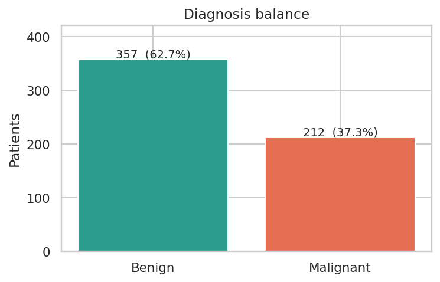
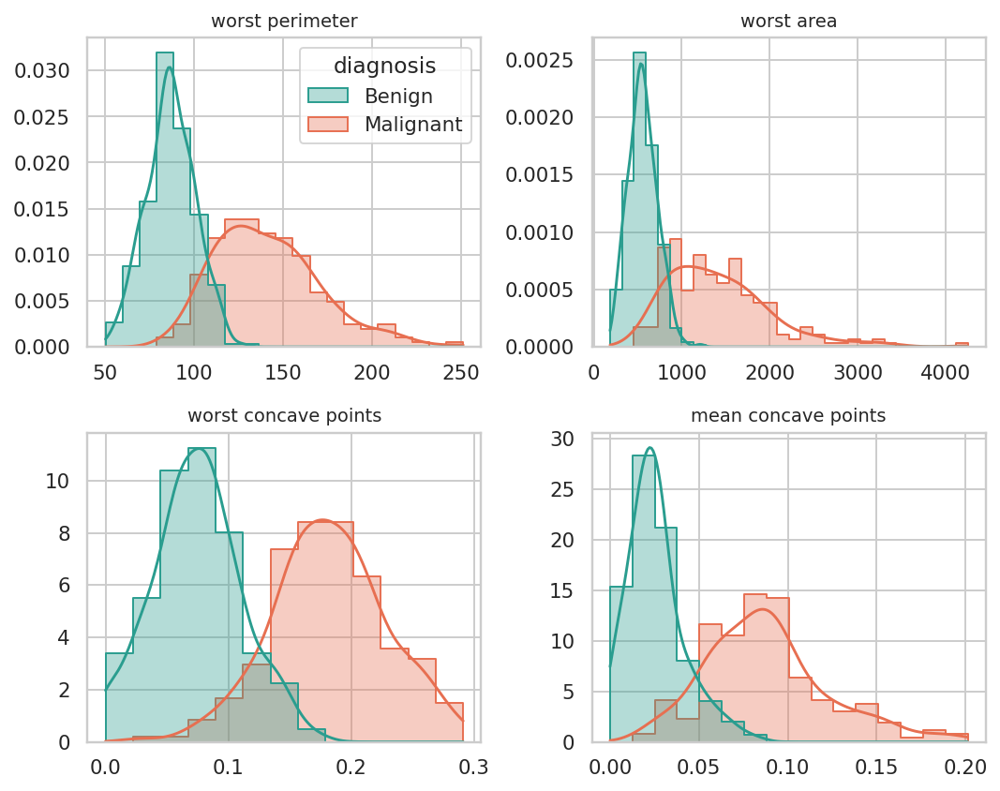
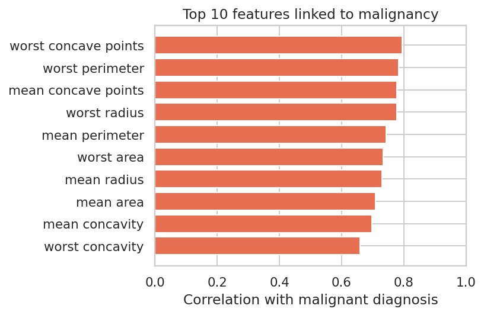
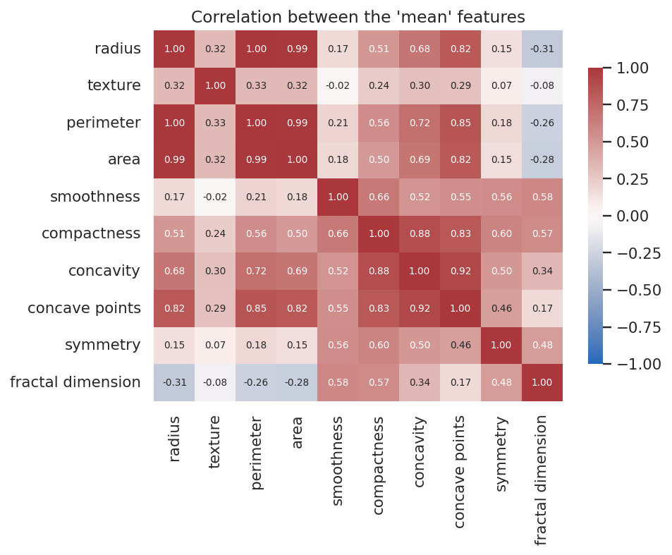
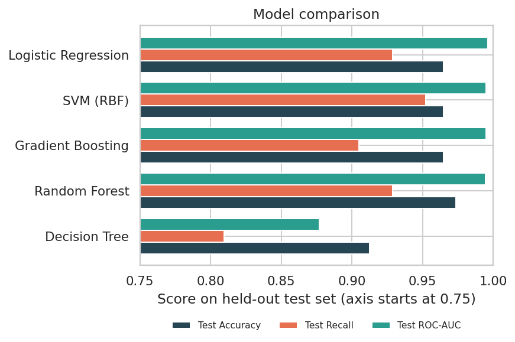
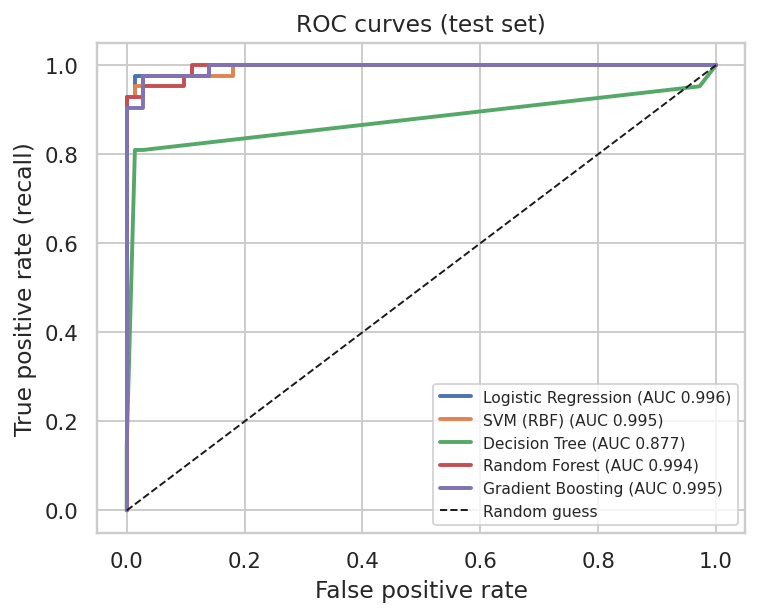
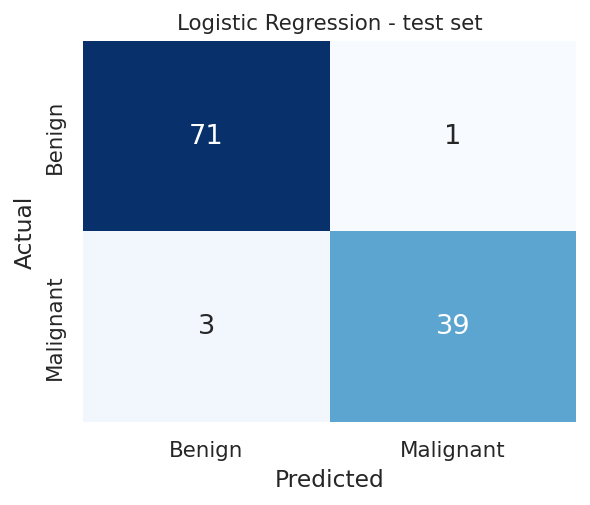
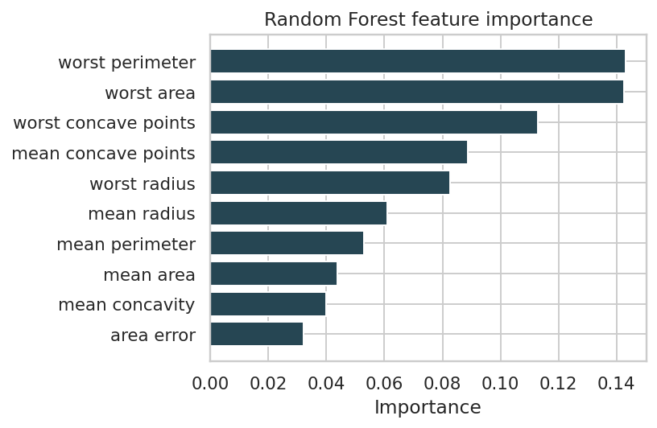
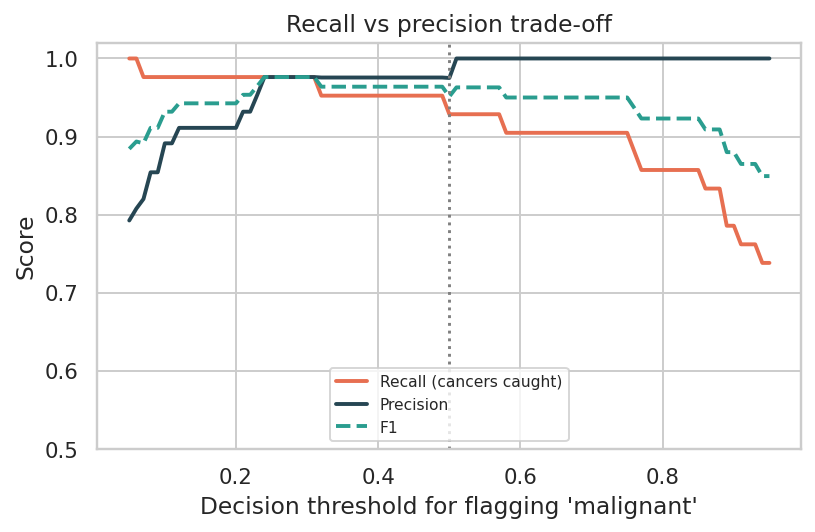

# 🩺 Breast Cancer Diagnosis Analysis

**An end-to-end healthcare data science project: from raw patient measurements to a tested prediction model and an interactive dashboard.**

Author: Vicky · Data Science Intern, Thiranex · [GitHub](https://github.com/vickybadmera7-sudo)

---

## 1. Problem statement

Early, accurate diagnosis of breast cancer saves lives. A fine-needle aspirate is taken from a breast mass and the cell nuclei are measured from a digitised image. This project asks:

> **Can these measurements alone distinguish a malignant tumour from a benign one, and how reliably?**

The project covers the full workflow: data checks, exploratory analysis, model comparison, evaluation, interpretation and a Streamlit dashboard.

## 2. Dataset

| | |
|---|---|
| **Name** | Breast Cancer Wisconsin (Diagnostic) |
| **Source** | UCI Machine Learning Repository (Wolberg, Street & Mangasarian); bundled with scikit-learn (`load_breast_cancer`) |
| **Patients** | 569 real patient records |
| **Features** | 30 numeric measurements: the *mean*, *standard error* and *worst* value of 10 nucleus properties (radius, texture, perimeter, area, smoothness, compactness, concavity, concave points, symmetry, fractal dimension) |
| **Target** | Diagnosis: 357 benign (62.7%) · 212 malignant (37.3%) |
| **Data quality** | 0 missing values, 0 duplicate rows |

Malignant is treated as the **positive class**, so *recall* = the share of real cancers the model catches.

## 3. Project structure

```
├── app.py               # Streamlit dashboard (5 tabs)
├── pipeline.py          # data loading, models, evaluation (shared by everything)
├── plots.py             # all charts
├── run_analysis.py      # regenerates images/ and model_results.csv
├── model_results.csv    # full model comparison table
├── requirements.txt
└── images/              # charts used in this README
```

## 4. Methodology

1. **Data checks:** missing values, duplicates, class balance.
2. **EDA:** distributions by diagnosis, correlation with the target, correlation between features.
3. **Split:** 80% train / 20% test, stratified (455 / 114 patients; the test set has 42 malignant cases).
4. **Models:** Logistic Regression, SVM (RBF), Decision Tree (depth 4), Random Forest (300 trees), Gradient Boosting. Scaling is applied inside a pipeline for the models that need it, so the test data never leaks into preprocessing.
5. **Model selection:** 5-fold stratified cross-validation on the **training set only** (ranked by ROC-AUC).
6. **Final evaluation:** each model is scored once on the untouched test set.
7. **Interpretation:** feature importance, confusion matrices and a decision-threshold analysis.

## 5. Exploratory findings

<p align="center"></p>

The classes are moderately imbalanced (37% malignant), so accuracy alone is not enough. **Recall on malignant cases** is tracked throughout.

<p align="center"></p>

- Malignant nuclei are clearly **larger and more irregular**. The average *worst area* is **1,422** for malignant vs **559** for benign cases (2.5x), and *mean concave points* is **0.088** vs **0.026** (3.4x).
- The features most correlated with malignancy are *worst concave points* (0.79), *worst perimeter* (0.78), *mean concave points* (0.78) and *worst radius* (0.78).

<p align="center"></p>

- Radius, perimeter and area are almost perfectly correlated because they all measure size. Importance is therefore shared between them.

<p align="center"></p>

## 6. Model results

| Model | CV ROC-AUC | Test Accuracy | Test Precision | Test Recall | Test F1 | Test ROC-AUC | Missed Cancers (FN) | False Alarms (FP) |
|---|---|---|---|---|---|---|---|---|
| **Logistic Regression** | 0.996 | 0.965 | 0.975 | 0.929 | 0.951 | 0.996 | 3 | 1 |
| SVM (RBF) | 0.995 | 0.965 | 0.952 | 0.952 | 0.952 | 0.995 | 2 | 2 |
| Gradient Boosting | 0.991 | 0.965 | 1.000 | 0.905 | 0.950 | 0.995 | 4 | 0 |
| Random Forest | 0.988 | 0.974 | 1.000 | 0.929 | 0.963 | 0.994 | 3 | 0 |
| Decision Tree | 0.902 | 0.912 | 0.944 | 0.809 | 0.872 | 0.877 | 8 | 2 |

*CV ROC-AUC is from 5-fold cross-validation on the training set; all other columns are on the 114-patient test set. "Missed cancers" are malignant cases predicted benign (false negatives).*

<p align="center"></p>
<p align="center"></p>

**Reading the results**

- **Logistic Regression** had the best cross-validated ROC-AUC (0.996). On the test set it reached **96.5% accuracy, 97.5% precision, 92.9% recall and 0.996 ROC-AUC**, missing 3 of 42 cancers with 1 false alarm.
- The four strongest models are very close. SVM caught the most cancers (2 missed), Random Forest had the highest accuracy (97.4%). With only 114 test patients, **one patient moves recall by about 2.4 points**, so these gaps are not statistically meaningful.
- The single **Decision Tree** is clearly the weakest (81% recall, 8 missed cancers).

<p align="center"></p>

### Which measurements matter most?

<p align="center"></p>

Random Forest importance ranks *worst perimeter*, *worst area*, *worst concave points*, *mean concave points* and *worst radius* highest. These describe nucleus **size and boundary irregularity**.

### Decision threshold: catching more cancers

By default a case is flagged as malignant when P(malignant) ≥ 0.50. Because a missed cancer is worse than a false alarm, the threshold can be lowered.

<p align="center"></p>

For Logistic Regression on this test set, moving the threshold from 0.50 to about 0.30 raised recall from 92.9% to **97.6%** (1 missed cancer instead of 3) with the same single false alarm. Lowering it further only adds false alarms: at 0.20 there are 4, and catching the last cancer needs a threshold near 0.06, where there are 10 false alarms and precision falls to about 81%.

> Caveat: this threshold was inspected on the test set, so the improvement is optimistic. In a real system the threshold should be chosen with cross-validation or a separate validation set.

### Compact model for the dashboard

The interactive "Predict" tab uses a logistic regression on **6 non-redundant features** (*worst perimeter, worst concave points, mean concavity, area error, worst concavity, mean compactness*), chosen from the training data by importance while skipping features that are more than 0.9 correlated with an already-chosen one. It reaches **97.4% test accuracy and 0.999 ROC-AUC**, so a handful of measurements carries almost all the signal.

## 7. Conclusions

1. Cell-nucleus measurements separate malignant from benign tumours very well: the best models reach roughly **96-97% accuracy and ~0.995 ROC-AUC** on unseen patients.
2. **Size and boundary irregularity** (perimeter, area, radius, concave points) are the strongest signals.
3. Simple, interpretable models (Logistic Regression, SVM) match or beat tree ensembles here; a single shallow Decision Tree does not.
4. Because the cost of a missed cancer is high, the **decision threshold matters as much as the model choice**.

## 8. Limitations and next steps

- Only 569 patients from one source, so results may not generalise to other hospitals or imaging set-ups.
- The small test set makes differences of one patient noise; repeated cross-validation would give firmer comparisons.
- Features come from images, not the full clinical picture. A real system would need clinical validation and doctor oversight.
- Next: hyper-parameter tuning, SHAP explanations, validation on an external dataset.

> ⚠️ **Disclaimer:** educational project only. It is not a medical device and must not be used to diagnose anyone.

## 9. Run it yourself

```bash
pip install -r requirements.txt
python run_analysis.py        # regenerates images/ and model_results.csv
streamlit run app.py          # launches the dashboard
```

**Deploy on Streamlit Community Cloud:** push this repo to GitHub, choose *New app*, select the repo, set the main file to `app.py`, and deploy. No data file or secrets are needed because the dataset ships with scikit-learn.
